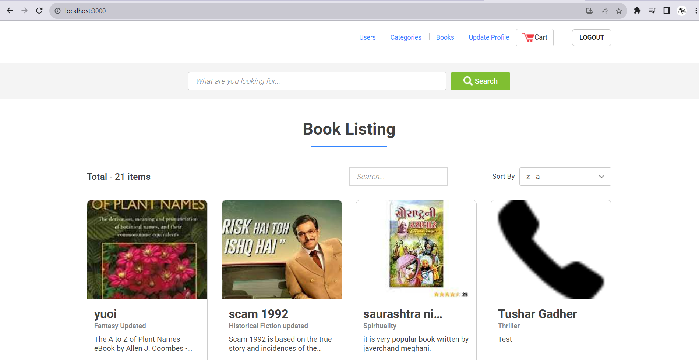

# E-BookStore_Tatvasoft


Welcome to the Ecommerce Bookstore, a modern web application built with ReactJS, Material-UI, HTML, CSS, and JavaScript. This project allows you to create and manage an online bookstore where users can browse, search, and purchase books. 📖



## Demo 🚀
Experience the Ecommerce Bookstore in action: [Live Demo](https://ebookstore-tatvasoft.netlify.app/) 🌐

## Features 🌟
📚 Browse a vast collection of books
🔍 Search for books by title, author, or genre
🛒 Add books to your shopping cart
💳 Checkout and make secure payments
📦 Track your order and receive shipping updates
👤 User authentication and profile management
🌟 Responsive and user-friendly design

## Getting Started 🚀
To get the Ecommerce Bookstore up and running on your local machine, follow these simple steps:

1. **Clone the repository**:
   ```
   git clone https://github.com/your-username/ecommerce-bookstore.git
   ```

2. **Navigate to the project directory**:
   ```
   cd ecommerce-bookstore
   ```

3. **Install dependencies**:
   ```
   npm install
   ```

4. **Run the development server**:
   ```
   npm start
   ```

The app should now be running on [http://localhost:3000](http://localhost:3000). Open this link in your web browser to start using the Ecommerce Bookstore locally.

## Usage 📖
1. **Browse Books**:
   - Explore the wide range of books available on the homepage.
   - Filter books by genre or search for specific titles or authors.

2. **Add to Cart**:
   - Click on a book to view its details.
   - Add books to your shopping cart by clicking the "Add to Cart" button.

3. **Checkout**:
   - When you're ready to complete your purchase, click the shopping cart icon.
   - Review your cart and click "Checkout."
   - Enter your shipping details and payment information.

4. **User Authentication**:
   - Sign up or log in to manage your profile and view order history.

5. **Responsive Design**:
   - The application is responsive and works seamlessly on both desktop and mobile devices.

## Technologies Used 💻
- ReactJS ⚛️
- Material-UI 🖌️
- HTML5 📄
- CSS3 🎨
- JavaScript 📜

## Contributing 🤝
We welcome contributions to the Ecommerce Bookstore project. If you'd like to help make it even better, please follow these steps:

1. Fork the repository.
2. Create a new branch for your feature or bug fix.
3. Make your changes and commit them.
4. Push your changes to your fork.
5. Submit a pull request with a detailed description of your changes.

## License 📝
This project is licensed under the MIT License - see the [LICENSE](LICENSE) file for details.

Happy reading and happy coding! 📚💻🚀

## Sections 📚
✔️ Login\
✔️ Register\
✔️ User Profile\
✔️ Book Page\
✔️ Categories\
✔️ Book Listing Page\
✔️ Cart Page\
✔️ Logout

# Getting Started with Create React App

This project was bootstrapped with [Create React App](https://github.com/facebook/create-react-app).

## Available Scripts

In the project directory, you can run:

### `npm start`

Runs the app in the development mode.\
Open [http://localhost:3000](http://localhost:3000) to view it in your browser.

The page will reload when you make changes.\
You may also see any lint errors in the console.

### `npm test`

Launches the test runner in the interactive watch mode.\
See the section about [running tests](https://facebook.github.io/create-react-app/docs/running-tests) for more information.

### `npm run build`

Builds the app for production to the `build` folder.\
It correctly bundles React in production mode and optimizes the build for the best performance.

The build is minified and the filenames include the hashes.\
Your app is ready to be deployed!

See the section about [deployment](https://facebook.github.io/create-react-app/docs/deployment) for more information.

### `npm run eject`

**Note: this is a one-way operation. Once you `eject`, you can't go back!**
